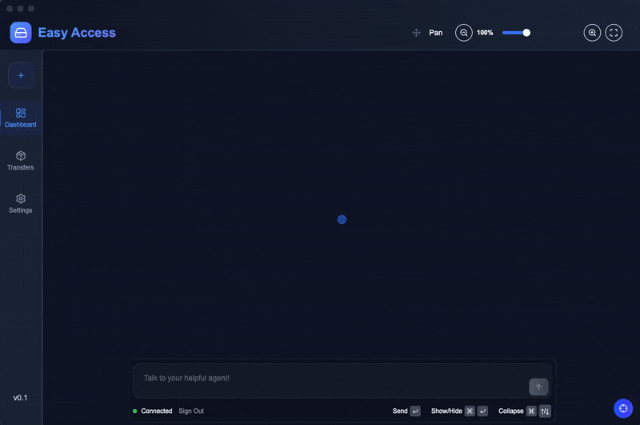
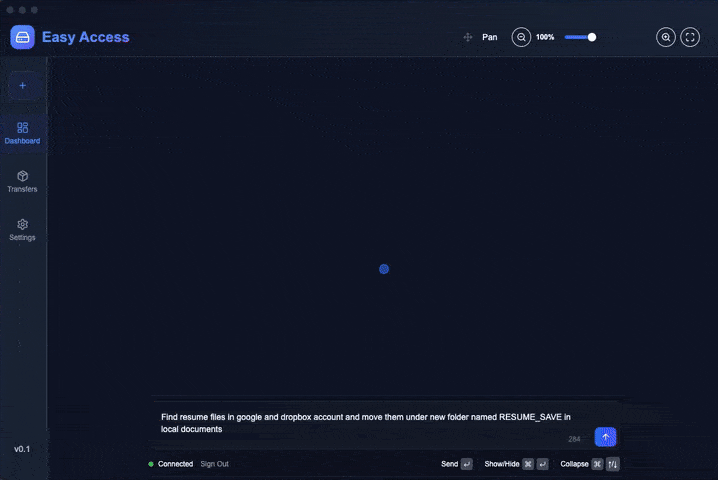
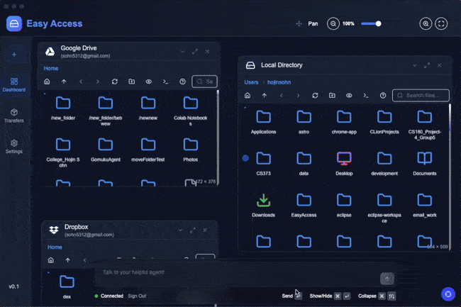
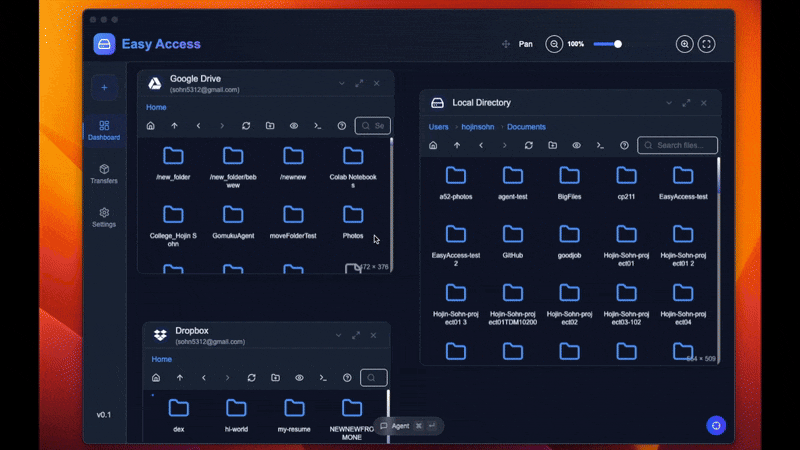
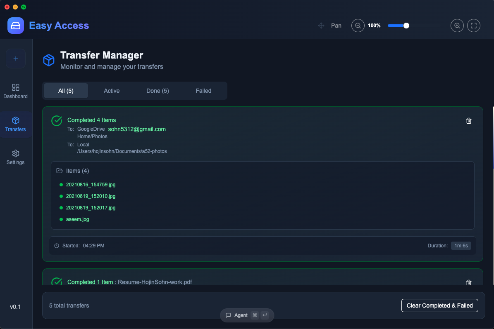

<h1 align="center">EasyAccess</h1>

<p align="center">
  The Ultimate Unified File Management Platform with AI Assistant<br/>
  Seamlessly Manage <strong>Google Drive</strong>, <strong>OneDrive</strong>, <strong>Dropbox</strong>, and Your <strong>Local Files</strong> All in One Place.
</p>

---

## ✨ Features

### 🌟 Unified File Management
- Access files from multiple cloud storage providers and local directories
- Manage files in Canvas-like interface in single view
- Drag-and-drop transfers between different storage services
- Real-time file synchronization and progress tracking

### 🤖 AI-Powered Assistant
- Built-in **Claude AI** assistant for intelligent file operations
- Natural language commands for file management tasks
- Automatic file organization and search capabilities

### ☁️ Multi-Cloud Support
- **Google Drive** – Full integration with Google Workspace files
- **OneDrive** – Microsoft cloud storage support
- **Dropbox** – Complete Dropbox file management
- **Local Files** – Native file system access with permission controls

### 🎨 Modern Interface
- Clean, intuitive **canvas-based** workspace
- Resizable and draggable storage boxes
- Dark/light theme support
- Responsive design that adapts to your workflow

---
## 📸 Demo

<div align="center">
  
  
  
  
  
</div>

---

## 🚀 Getting Started

### Prerequisites
- **macOS 10.15+** 
- **Node.js 18+** 

### Quick Start
```bash
git clone https://github.com/CSGrinders/EasyAccess/easyaccess.git
npm install
npm run dev
npm start
```

### ⚙️ Configuration
Environment Variables for **Google Drive**, **OneDrive**, **Dropbox** Integration 
Create a .env file in the project root:

```bash
GOOGLE_CLIENT_ID=your_google_client_id
GOOGLE_CLIENT_SECRET=your_google_client_secret
ONEDRIVE_CLIENT_ID=your_onedrive_client_id
ONEDRIVE_CLIENT_SECRET=your_onedrive_client_secret
DROPBOX_CLIENT_ID=your_dropbox_client_id
DROPBOX_CLIENT_SECRET=your_dropbox_client_secret
ANTHROPIC_API_KEY=your_anthropic_api_key
```
> ## 🔑 Note on API Credentials & Security Testing
> For security and testing purposes, official **Google**, **OneDrive**, and **Dropbox** credentials are **not bundled** with this repository.  
>  
> **Users must provide their own API keys** by creating apps in the respective developer consoles:  
> - [Google Drive OAuth Setup](https://developers.google.com/drive/api/v3/quickstart/js)  
> - [OneDrive App Registration](https://learn.microsoft.com/en-us/graph/auth-register-app-v2)  
> - [Dropbox App Console](https://www.dropbox.com/developers/apps)  
>  
> ### 🤖 AI Assistant API  
> - By default, users can **register with us** to receive **10 free Claude AI calls** for demo purposes.  
> - Alternatively, set your own `ANTHROPIC_API_KEY` in `.env` to use your personal Claude API quota.

## 📄 License

MIT License - see [LICENSE](LICENSE) for details.

---

<p align="center">Made with ❤️ using Electron, React, and Anthropic API</p>